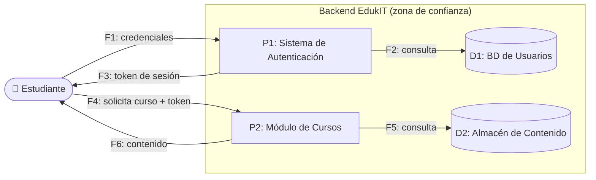

# 🧭 Guía Paso a Paso: Evaluación de Seguridad con STRIDE

Esta guía complementa el `README.md` del taller. Su objetivo es que, antes de analizar un flujo crítico de EdukIT en clase (Parte 1) o del sistema del cliente real (Parte 2), el equipo tenga una referencia clara del marco STRIDE y de la metodología para pasar de "dibujar el flujo" a "priorizar amenazas reales".

El diagrama de ejemplo de esta guía está escrito en [Mermaid](https://mermaid.js.org/) y se renderiza automáticamente al ver este archivo en GitHub.

---

## 1. Las 6 categorías de STRIDE

| Categoría | Pregunta guía | Ejemplo típico |
|---|---|---|
| **S**poofing (Suplantación) | ¿Alguien puede hacerse pasar por otro usuario o sistema? | Credenciales robadas, phishing |
| **T**ampering (Alteración) | ¿Alguien puede modificar datos o mensajes sin autorización? | Interceptar y modificar un token en tránsito |
| **R**epudiation (Repudio) | ¿Alguien puede negar haber realizado una acción? | Falta de logs de auditoría |
| **I**nformation Disclosure (Divulgación) | ¿Puede exponerse información que debería ser privada? | Consulta sin control de acceso, backup expuesto |
| **D**enial of Service (Denegación de servicio) | ¿Puede alguien dejar el sistema o un componente inaccesible? | Saturación de solicitudes |
| **E**levation of Privilege (Elevación de privilegios) | ¿Puede alguien obtener permisos mayores a los que le corresponden? | Manipular el rol en una solicitud |

---

## 2. Metodología en 5 pasos

STRIDE no se aplica "en el aire": se aplica sobre un diagrama de flujo de datos (DFD) del proceso. Sin ese diagrama, las amenazas terminan siendo genéricas.

1. **Elegir el flujo y dibujar su DFD** — represente el flujo crítico como actores externos, procesos, almacenes de datos y los flujos entre ellos, marcando el límite de confianza (qué está dentro y qué está fuera del control del sistema).
2. **Identificar los elementos a analizar** — liste cada proceso, almacén de datos y flujo del DFD; cada uno es candidato a amenazas.
3. **Aplicar las 6 categorías STRIDE** — para cada elemento relevante, formule la amenaza concreta en cada categoría que aplique (no todas las categorías aplican a todos los elementos).
4. **Evaluar impacto y proponer mitigación** — para cada amenaza identificada, describa su impacto y un control concreto que la mitigue.
5. **Priorizar por riesgo** — combine impacto y probabilidad para asignar un nivel de riesgo a cada amenaza y ordene la tabla de mayor a menor riesgo.

---

## 3. Ejemplo guiado: Acceso de estudiantes a cursos y materiales (EdukIT)

### Paso 1 — Elegir el flujo y dibujar su DFD

Se elige el flujo de **acceso de estudiantes a cursos y materiales**: el estudiante se autentica y luego solicita el contenido de un curso. Se marca el límite de confianza entre el estudiante (fuera del control de EdukIT) y el backend (dentro).

### Paso 2 — Identificar los elementos a analizar

| ID | Elemento | Tipo |
|---|---|---|
| E1 | Estudiante | Actor externo |
| P1 | Sistema de Autenticación | Proceso |
| P2 | Módulo de Cursos | Proceso |
| D1 | BD de Usuarios | Almacén de datos |
| D2 | Almacén de Contenido | Almacén de datos |
| F1–F6 | Flujos de datos entre los anteriores | Flujo |

### Paso 3 — Aplicar las 6 categorías STRIDE

Se formula una amenaza concreta por categoría, señalando el elemento exacto sobre el que ocurre (todavía sin impacto ni mitigación):

| Categoría | Elemento | Amenaza concreta |
|---|---|---|
| Spoofing | E1 / F1 | Un atacante se hace pasar por un estudiante usando credenciales robadas o phishing. |
| Tampering | F3 | El token de sesión es interceptado y modificado en tránsito si la comunicación no usa TLS. |
| Repudiation | P1 | Un estudiante o administrador realiza una acción sensible (ej. cambia una nota) y luego niega haberlo hecho, por falta de registro de auditoría. |
| Information Disclosure | D1 | Exposición de datos personales o notas académicas por una consulta sin control de acceso adecuado. |
| Denial of Service | P2 | Un atacante satura las solicitudes de contenido y deja el módulo de cursos inaccesible durante un examen. |
| Elevation of Privilege | F4 | Un estudiante manipula el parámetro de rol en la solicitud para acceder a funciones de docente o administrador. |

### Paso 4 — Evaluar impacto y proponer mitigación

| Categoría | Amenaza | Impacto | Mitigación propuesta |
|---|---|---|---|
| Spoofing | Suplantación de estudiante | Alto — acceso no autorizado a la cuenta y sus datos | Autenticación multifactor (MFA) y bloqueo tras intentos fallidos |
| Tampering | Alteración del token de sesión | Alto — secuestro de sesión activa | Forzar HTTPS/TLS en todas las comunicaciones y firmar/verificar el token (JWT) |
| Repudiation | Negación de una acción realizada | Medio — dificulta resolver disputas académicas | Registro de auditoría (logs) con marca de tiempo y usuario para acciones sensibles |
| Information Disclosure | Exposición de datos personales/notas | Alto — incumplimiento de protección de datos (Ley 1581) | Cifrado en reposo y control de acceso basado en roles (RBAC) a nivel de consulta |
| Denial of Service | Saturación del módulo de cursos | Medio — interrupción temporal del servicio | Límite de tasa (rate limiting) y auto-escalado con balanceo de carga |
| Elevation of Privilege | Acceso a funciones de docente/admin | Alto — control total sobre contenido o calificaciones ajenas | Validar el rol en el servidor en cada solicitud; nunca confiar en el rol enviado por el cliente |

### Paso 5 — Priorizar por riesgo

Se agregan probabilidad y riesgo resultante (Impacto × Probabilidad), y se ordena de mayor a menor riesgo — esta es la tabla que se entrega como `tabla-stride-cliente.xlsx`.

| Prioridad | Categoría | Amenaza | Impacto | Probabilidad | Riesgo |
|---|---|---|---|---|---|
| 1 | Information Disclosure | Exposición de datos personales/notas | Alto | Media | **Alto** |
| 2 | Spoofing | Suplantación de estudiante | Alto | Media | **Alto** |
| 3 | Elevation of Privilege | Acceso a funciones de docente/admin | Alto | Baja | Medio |
| 4 | Tampering | Alteración del token de sesión | Alto | Baja | Medio |
| 5 | Repudiation | Negación de una acción realizada | Medio | Media | Medio |
| 6 | Denial of Service | Saturación del módulo de cursos | Medio | Baja | Bajo |

---

## 4. Errores comunes a evitar

| Error frecuente | Por qué es un problema | Cómo corregirlo |
|---|---|---|
| Amenazas genéricas ("puede haber un hackeo") | No es accionable ni evaluable: no dice qué elemento ni cómo | Formule la amenaza sobre un elemento específico del DFD (ej. "el flujo F1 puede ser interceptado...") |
| Aplicar solo 2–3 categorías y omitir el resto | El marco pierde su propósito: cubrir sistemáticamente los 6 tipos de riesgo | Revise las 6 categorías para cada elemento relevante, aunque alguna no aplique |
| Mitigación vaga ("mejorar la seguridad") | No es una acción verificable ni evaluable en la rúbrica | Proponga un control concreto (MFA, cifrado, rate limiting, RBAC, logs de auditoría, etc.) |
| No priorizar los hallazgos | Un informe con muchas amenazas sin orden no ayuda a decidir qué atender primero | Clasifique cada amenaza por impacto × probabilidad y priorice (Paso 5) |

---

## 5. Checklist de autoevaluación antes de entregar

- [ ] Se documentó un DFD (o descripción equivalente) del flujo analizado, con procesos, almacenes de datos y flujos.
- [ ] Se aplicaron las 6 categorías STRIDE sobre los elementos relevantes del flujo.
- [ ] Cada amenaza está redactada sobre un elemento específico, no de forma genérica.
- [ ] Cada amenaza tiene una mitigación concreta y verificable.
- [ ] Cada amenaza tiene impacto, probabilidad y nivel de riesgo asignado.
- [ ] Los hallazgos están priorizados de mayor a menor riesgo.

---

_Esta guía hace parte del Taller 5 de Evaluación de Seguridad con STRIDE — curso Arquitectura Empresarial, Universidad de La Sabana._
